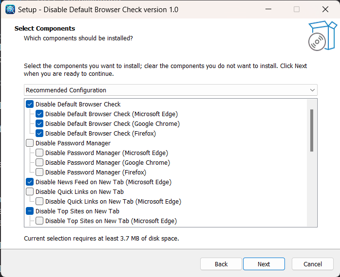

# Disable Default Browser Check

Disable default browser check and some other features of Edge, Chrome and
Firefox using group policy.

## Supported Browser

* Microsoft Edge
* Google Chrome
* Mozilla Firefox

## Features

* Disable Default Browser Check
    * Disable Default Browser Check (Microsoft Edge)
    * Disable Default Browser Check (Google Chrome)
    * Disable Default Browser Check (Firefox)
* Disable Password Manager
    * Disable Password Manager (Microsoft Edge)
    * Disable Password Manager (Google Chrome)
    * Disable Password Manager (Firefox)
* Disable News Feed on New Tab (Microsoft Edge)
* Disable Quick Links on New Tab
    * Disable Quick Links on New Tab (Microsoft Edge)
* Disable Top Sites on New Tab
    * Disable Top Sites on New Tab (Microsoft Edge)
    * Disable Top Sites on New Tab (Firefox)
    * Disable Sponsored Top Sites on New Tab (Firefox)
* Disable Sleeping Tabs (Microsoft Edge)
* Disable Background Image on New Tab (Microsoft Edge)
* Disable Collections (Microsoft Edge)
* Disable Drop Service (Microsoft Edge)
* Disable Follow Service (Microsoft Edge)
* Disable Shopping Assistant (Microsoft Edge)
* Disable Wallet Checkout (Microsoft Edge)
* Disable Wallet E-Tree (Microsoft Edge)
* Disable Browser Import
    * Disable Browser Import (Microsoft Edge)
    * Disable Browser Import (Firefox)
* Disable Browser Import (Google Chrome)
* Disable Mini Menu (Microsoft Edge)
* Disable First Run Experience (Microsoft Edge)
* Disable Set As Desktop Background... Menu (Firefox)
* Disable Translate
   * Disable Translate (Microsoft Edge)
   * Disable Translate (Google Chrome)

## Limitations

* Cannot install if some group polices are configured.
